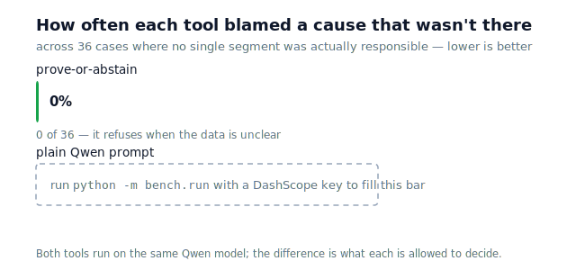

# prove-or-abstain


**A number dropped. Before anyone acts, one question: is one thing broken, or
is everything just a little soft?** `prove-or-abstain` answers it — and,
unlike every other "AI for analytics" tool, it refuses to answer when the data
can't actually support one.

> 🎚️ **Try the live slider** (`/explore` on the running service): drag from
> "the drop is everywhere" to "from one channel" and watch the tool switch
> between **"not sure yet"** and **"we found it"** at a clean, reproducible
> point.

### The problem

You run an online store. This weekend, orders dropped. Point any AI assistant
at it and it will confidently name a culprit — a channel, a device, a region —
whether or not the data points to one. Act on a wrong-but-confident answer and
you've sent the team chasing a ghost, or worse, "fixed" something that wasn't
broken. A tool you let act on your data needs the opposite instinct: the
discipline to say **"not sure yet"** instead of guessing.

### What it does

Point it at two periods — last week vs this week — and it returns one of two
answers, never a fabricated third:

- ✅ **We found it.** One channel (or device, or region) clearly carries the
  drop. The tool names it, quantifies it, and proposes a scoped fix — or, on
  autopilot, acts on it.
- 🤔 **Not sure yet.** The drop is spread out, or too small to trust. The tool
  says so, names *why* it can't conclude, and hands off to a human instead of
  inventing a cause.

The second answer is the whole point. On **45 test cases where there was no
single real cause, this tool invented one 0 times** — because the verdict is
decided by arithmetic, not by how confident the model sounds. This tool and a
plain-prompt assistant run on the *same* Qwen model; the difference is not the
model, it's what we let it decide. (The head-to-head against that plain-prompt
baseline is the benchmark below.)

## An example investigation

Monday morning, an online store's dashboard shows checkout conversion down
from 7% to 5% over the weekend — a 29% drop, far past the point of "noise".
Someone has to answer one question before touching anything: *is this one
broken thing, or is the whole funnel just soft?*

Point `prove-or-abstain` at the two periods (the `clean` panel) and it runs
that reasoning explicitly:

1. **detector** confirms the move is material (29% ≫ 2%) and worth explaining.
2. **hypothesizer** asks Qwen which dimension to try first; it suggests
   `device`.
3. **investigator + verifier** decompose along `device` — and *abstain*:
   the drop is spread ~50/50 across mobile and desktop, so no device
   localizes it. A weaker agent would stop here and blame "mobile, probably".
4. The loop tries the next dimension, `segment`, and this time every gate
   passes: **the entire move concentrates on the `paid` segment**
   (concentration 1.00), the z-test is decisive (p ≈ 4e-6), rate and mix are
   cleanly separable.
5. **ASSERT** — root cause `segment=paid`, confidence 0.79. The paid-traffic
   funnel broke; organic, referral and email are fine.
6. Only now does Qwen add labelled speculation about the *why* — a campaign
   change? a landing-page regression on the paid ads? — for a human to check.
   The proven part (`segment=paid`) and the guesswork stay strictly apart.

The same agent on the `diffuse` panel — every segment down by the same amount
— reaches step 4, finds nothing concentrated, and **ABSTAINs** with a named
reason instead of inventing a culprit. That contrast is the whole product.

## The benchmark

We built 45 test cases with a known answer: 9 where one segment really is the
cause, and 36 where there is no single cause (the drop is spread out, entangled
with a population shift, pure noise, or too small to trust). Then we scored
this tool on all 45.



| | prove-or-abstain |
|---|---|
| **Blamed a cause that wasn't there** (36 no-cause cases) | **0%** |
| Found the real cause when there was one (9 cases) | **100%** |
| Right every time it did claim a cause | **100%** |
| Named a real reason when it declined | **100%** |

The headline is the first row: **zero invented causes.** The tool finds every
real cause and never manufactures a fake one — and whenever it declines, it
points at a specific reason the data failed (too spread out, not significant,
mechanism entangled), never a shrug.

The comparison that matters is against a plain-prompt assistant on the *same*
Qwen model — handed the same numbers and asked, honestly, to find the cause or
say there isn't one. That column fills in when the benchmark runs with a
DashScope key:

```bash
python -m bench.run          # our column now; both columns with a key set
python -m bench.figure       # regenerate docs/benchmark.svg
```

The point isn't that Qwen is weak — it's that the discipline lives in the
scaffolding around the model, not the model itself. See [`bench/`](bench/).

---

## How it works (for the technically curious)

Two words map to everything below: **"we found it" is `ASSERT`**, **"not sure
yet" is `ABSTAIN`** — the verdicts the API actually returns.


The agent is a LangGraph state machine with seven nodes and one conditional
loop. When a dimension fails to localize the cause, the verifier routes back
to the hypothesizer to try the next candidate dimension; the loop is bounded
by the number of dimensions, so it always terminates.

| Node | Role |
|------|------|
| detector | compares each metric to its baseline, flags material moves |
| hypothesizer | selects the next dimension to test |
| investigator | decomposes the metric change along that dimension (`attribution.py`) |
| verifier | checks the decomposition against the gates (`gates.py`) |
| driller | after an ASSERT, re-decomposes within the winning segment to refine the cause |
| actuator | maps the verdict to a typed action: recommend, execute, or escalate |
| reporter | writes the conclusion and keeps the full audit trail |

Responsibilities are split strictly. All numbers come from pandas/numpy. The
LLM (Qwen via DashScope) does three things only: suggest the order in which
dimensions are tested, phrase the final report from figures that are already
computed, and — on ASSERT only — offer business hypotheses about the *why*,
explicitly labelled as unverified speculation. It never produces a number and
never decides a verdict, so the verdict is identical with or without it — a
deterministic mock (`QWEN_MOCK=1`) runs the same pipeline offline.

> **The LLM boundary, proven.** This is not just a claim in prose. A test
> (`test_verdict_is_independent_of_the_llm`) runs the same panels through the
> full pipeline twice — once with the deterministic mock, once with a
> divergent Qwen stand-in that reverses the dimension order and returns
> different text — and asserts the verdict, root cause, confidence and gate
> numbers are **bit-for-bit identical**. The LLM provably moves only words.
> `QWEN_MOCK=1 pytest -q -k independent_of_the_llm` demonstrates it in one
> command.

### Why Qwen (and where it is deliberately absent)

Both this tool and a plain-prompt assistant run on the **same** Qwen model; the
difference is not the model, it's what we let it decide. Qwen is indispensable
at the **two ends** — turning a plain-language question into a structured
request (`why did sales drop?` → *investigate conversion*), and turning the
proven figures into a readable note — and **deliberately absent from the
middle**, where the verdict is decided by arithmetic. That boundary is the
whole design: the LLM frames and phrases; the math judges.


The dimension-ranking step is a Qwen **function call**: the model answers
through a `rank_dimensions` tool whose JSON schema constrains the output to a
permutation of the candidate dimensions (`enum` per item), so the plan is
typed at the protocol level rather than parsed out of prose. That is exactly
the shape of task the boundary allows the model — a structured suggestion that
the deterministic math then validates — and it makes the LLM's contribution
robust instead of a best-effort text parse. The call is on the investigation's
hot path, so its latency is measured and surfaced in the trace
(`Qwen (qwen-plus) ranked dimensions in NN ms`); `qwen-plus` on DashScope
returns the ranking fast enough to keep the loop interactive. Every Qwen call
falls back to a deterministic path on any error, so the agent never stalls or
crashes on the model — and `QWEN_MOCK=1` removes it from the loop entirely for
reproducible demos.

## Verification gates

`ASSERT` requires all five gates to pass. A failed gate produces an
`ABSTAIN` with the failing condition named in the response.

| Gate | Condition | Purpose |
|------|-----------|---------|
| material | \|ΔR\|/R₀ ≥ 2% | the move is large enough to matter |
| localized | top contribution share ≥ 0.55 | one segment actually dominates |
| significant | two-proportion z-test on the leading segment, p ≤ 0.01 | the leader's move is not sampling noise |
| clean | interaction share ≤ 0.50 | rate and mix effects are separable |
| confident | concentration × significance × cleanliness ≥ 0.30 | the gates don't all pass only marginally |

The significance gate is a real hypothesis test, not a magic sample-size
number: a perfectly concentrated move on a segment of 60 users abstains with
`p=0.55`, the same move on 6000 users asserts with `p<1e-5`. For sum metrics
(no per-unit variance to test against) it falls back to a minimum-sample
floor of 1000.

The confidence gate is the one that hardens the agent against arbitrary data.
The four structural gates are pass/fail on independent conditions, and each
can clear its threshold by a hair; on genuinely random panels one segment
often just barely dominates *and* the z-test just barely fires on large `n`,
so the four-gate design ASSERTs a spurious cause about half the time. Folding
the same factors into a single confidence product and requiring ≥ 0.30 cuts
that to ~15% while leaving every calibrated demo verdict unchanged — a move
that only marginally clears each gate does not clear their product. Because
autopilot already needs confidence ≥ 0.70, no autonomous action was ever at
risk; this gate governs the `RECOMMEND` path.

Input counts are validated at the API boundary: `n` and `c` must be
non-negative, and for rate metrics `c ≤ n` (a numerator cannot exceed its
population). Invalid rows are rejected as a `400`, never reaching the z-test
as an ill-formed proportion. Sum metrics are exempt from `c ≤ n`, since there
`c` is a total (revenue) that legitimately exceeds `n` (customers).

## Quickstart

Requires Python 3.11+ (the pinned pandas/numpy versions do not install on
older interpreters; developed and tested on 3.12).

```bash
python3 -m venv .venv && source .venv/bin/activate
pip install -r requirements.txt

export QWEN_MOCK=1        # run offline; omit if DASHSCOPE_API_KEY is set
pytest -q                 # math vs. oracle, gate verdicts, API behaviour

uvicorn api.app:app --reload
```

Open http://localhost:8000 for the demo page — run the built-in scenarios or
upload your own CSVs — or use the API directly:

```bash
curl -X POST localhost:8000/investigate \
  -H 'content-type: application/json' -d '{"panel":"clean"}'
```

## API

```
GET  /                     demo page
POST /investigate
  body:   { "panel": "clean" | "diffuse" | "mixshift" | "deep", "autopilot": false }
  return: { verdict, confidence, root_cause, gates, drilldown,
            action, report, speculations, trace }
POST /investigate/ask
  body:   { "question": "why did sales drop last week?", "panel": "clean" }
  parses the question to a metric (Qwen, offline keyword fallback), then runs
  the deterministic pipeline; returns the verdict plus the parsed request
POST /investigate/upload
  multipart: baseline=<csv>, current=<csv>, autopilot=<bool>, sum_metrics=<csv names>
  same return shape
POST /investigate/suggest
  multipart: file=<csv>
  return: { columns, default:{dimensions,sum_metrics,metrics}, suggestion }
  framing aid only — proposes a setup for the user to confirm, runs nothing
POST /investigate/series
  multipart: series=<csv with a 'period' column>, window=<int, optional>,
             seasonal_period=<int, optional>
  last period vs. a rolling baseline pooled over the prior `window` periods;
  with seasonal_period=k, pooled over the in-phase prior periods only
GET  /health
```

The endpoint builds the initial state, runs the graph, and serializes the
result; the service layer contains no analysis logic.

Four built-in panels cover the interesting outcomes:

- `clean` — one segment's conversion rate collapses while everything else is
  stable. The first dimension tried (`device`) fails to localize, the second
  (`segment`) succeeds: **ASSERT**, cause `segment=paid`.
- `diffuse` — every segment drops by the same amount. Same aggregate change
  as `clean`, but no dimension concentrates it: **ABSTAIN**.
- `mixshift` — population mix and rates shift at the same time, so rate and
  mix effects are entangled: **ABSTAIN**, for a different named reason than
  `diffuse`.
- `deep` — a single cell (`paid × mobile`) collapses: **ASSERT**
  `device=mobile`, then the driller narrows it to `segment=paid` within
  mobile.

After an ASSERT, the response also carries `speculations`: short business
hypotheses about the *why* (a campaign change? a payment incident?), written
by the LLM and explicitly labelled as unverified speculation — kept strictly
apart from the proven verdict.

With autopilot on (`"autopilot": true`), an ASSERT with confidence ≥ 0.70
returns an `EXECUTE` action instead of a recommendation. An ABSTAIN never
executes, regardless of flags; the test suite enforces this.

### Action dispatch

An `EXECUTE` action is dispatched to a sink (`sinks.py`): if
`ACTION_WEBHOOK_URL` is set, the agent POSTs the action to that endpoint
(Slack, an ops webhook, a queue) and the response carries a `dispatch`
receipt — `{dispatched, target, detail}`. With no URL configured it is a
**dry run**: the receipt reports what it *would* send and no network call is
made, so the default setup stays offline and deterministic. Only an `EXECUTE`
is ever dispatched — every `RECOMMEND` and `ESCALATE` (and so every
`ABSTAIN`) returns `dispatched: false` without touching the network, which is
the second line of the same safety property the actuator enforces, and it is
tested directly.

```bash
export ACTION_WEBHOOK_URL=https://hooks.example.com/…
curl -X POST localhost:8000/investigate \
  -H 'content-type: application/json' -d '{"panel":"clean","autopilot":true}'
# -> action.kind = EXECUTE, dispatch.dispatched = true
```

### Bring your own data

`POST /investigate/upload` takes two CSVs in long panel format — one row per
(metric, segment...) cell, with raw counts:

```
metric, <dim1>, [<dim2>, ...], n, c
```

`n` is the cell's population, `c` the numerator (conversions, churned users,
…). Dimension columns are inferred: everything except `metric`, `n`, `c` and
`period`. Sample files live in `examples/`:

```bash
curl -X POST localhost:8000/investigate/upload \
  -F baseline=@examples/baseline.csv \
  -F current=@examples/current_clean.csv

# sum metric (revenue): n = customers, c = total amount
curl -X POST localhost:8000/investigate/upload \
  -F baseline=@examples/revenue_baseline.csv \
  -F current=@examples/revenue_current.csv \
  -F sum_metrics=revenue

# time series: one CSV with a 'period' column, rolling pooled baseline
curl -X POST localhost:8000/investigate/series \
  -F series=@examples/series_clean.csv -F window=4

# seasonal baseline: a daily series with a weekly cycle — compare the last day
# to the same weekday in prior weeks (k=7) instead of a naive pool.
curl -X POST localhost:8000/investigate/series \
  -F series=@examples/series_seasonal.csv -F seasonal_period=7
```

In `examples/series_seasonal.csv` the last day is a normal weekend: a naive
pooled baseline mixes in weekday rates and cries anomaly (−36%), while
`seasonal_period=7` compares like-for-like and correctly reports no anomaly.

Metrics named in `sum_metrics` are decomposed as sums (volume/rate split,
e.g. revenue = customers × average basket) instead of rates.

## Attribution math

For a rate metric `R = Σ wₛ·rₛ` (segment weight × segment rate), the change
between periods decomposes exactly, per segment:

```
rate        = w₀·(r₁ − r₀)        the segment's rate moved
mix         = r₀·(w₁ − w₀)        the population composition moved
interaction = (w₁ − w₀)·(r₁ − r₀)
contribution = rate + mix + interaction
```

Segment contributions sum to the total ΔR with zero residual.
`attribution.py` is validated against an independently written oracle
(`attribution_reference.py`) in the test suite and in `gate_check.py`.

Sum metrics (`decompose_sum`) use the same algebra with raw counts instead
of shares: ΔV splits per segment into a volume effect (`r₀·Δn`), a rate
effect (`n₀·Δr`) and their interaction, summing to `c₁ − c₀` exactly.

## Docker

```bash
docker build -t prove-or-abstain .
docker run -p 8000:8000 -e DASHSCOPE_API_KEY=... prove-or-abstain
```

Secrets are injected at runtime; `.env` is excluded from the image and the
container runs as an unprivileged user. Without a key the service falls back to
mock mode; set `ACTION_WEBHOOK_URL` (also at runtime) to dispatch autopilot
`EXECUTE` actions to a real endpoint. For Alibaba Cloud, push an amd64 image to
Container Registry and run it on Function Compute (custom-container runtime,
port 8000, HTTP trigger) — `/health` serves as the probe endpoint. The helper
`deploy/aliyun.sh` builds and pushes the image; **[`docs/deploy.md`](docs/deploy.md)**
is the click-by-click.

```bash
docker buildx build --platform linux/amd64 \
  -t registry.<region>.aliyuncs.com/<namespace>/prove-or-abstain:v1 --push .
```

## Limitations

- No live data connectors yet — data comes in as CSV uploads or the built-in
  panels.
- The rolling baseline supports a fixed seasonal period (e.g. weekly), but no
  automatic seasonality detection or trend modelling.
- Drill-down goes one level deep (winning segment × one other dimension).
- Action dispatch is a single generic webhook (`ACTION_WEBHOOK_URL`); there
  are no first-class connectors (Slack/Jira/Stripe) or a closed loop that
  observes the effect of an executed action yet.

## License

MIT.
